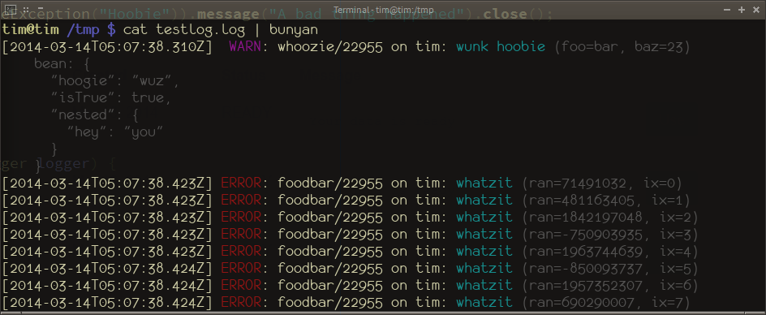

bunyan-java
===========

An opinionated implementation of a simple logger in Java whose output is compatible with
[bunyan](https://github.com/trentm/node-bunyan) JSON logger, the excellent 
logger for [NodeJS](http://nodejs.org).

Uses [Guice](https://code.google.com/p/google-guice/) for injection, and has a fluent interface
and support for using ``@Named`` to inject named loggers.  Uses 
[AutoCloseable](http://timboudreau.com/blog/AutoCloseable/read) to enable a log record to
be appended to, builder-style, and automatically written when its ``close()`` method is
implicitly or explicitly called.

        class LogUser {
           private final Logger logger;
           LogUser(@Named("whatzit") Logger logger) {
              try (Log<Debug> log = logger.debug("someTask")) {
                  log.add("append to the message");
                  log.add(someObject);
                  log.add("foo", "bar");
              }
           }
        }

File or console logging or both are available, others can be implemented.

Dependencies
------------

Joda Time, Guice, Giulius, Jackson

You do not have to use Giulius, but the default ``LogWriter`` implementation expects to find
an instance of ``Settings`` bound.  If you want to use plain Guice, you'll need to implement
``LogWriter`` or provide a ``Settings``.

It is also useful to include giulius-jackson's ``JacksonModule``, which will automatically
find and bind a Jackson module that adds an improved serializer for ``Throwable``s.

Usage
-----

Logging is configured using [Giulius](https://github.com/timboudreau/giulius) settings
API, which by default uses properties files which may be in ``/etc/``, ``~/`` and/or
``./``.  If you do not bind your own implementation of ``LogWriter``, the default 
one is affected by these properties:

 * ``log.file`` - if set to a file path, log to this file instead of the console
 * ``log.console`` - also log to the console, even if a file is set
 * ``log.async`` - write log records out on a background thread, so the caller is not blocked
   * A VM shutdown hook ensures that if the VM is not brutally killed, all pending log records are
flushed synchronously during shutdown
 * ``log.level`` - the level of log below which log records should be discarded

A Guice module, ``LoggingModule`` is provided, which makes it easy to use Guice's ``@Named``
to inject loggers:

		Settings s = new SettingsBuilder("app-name").addDefaultLocations().build();
                LoggingModule mod = new LoggingModule().bindLogger("mailer");

		Dependencies deps = Dependencies.builder().add(Namespace.DEFAULT, s).add(new LoggingModule());
                
		// ... then

		class Mailer {
                   Mailer (@Named("mailer") Logger logger, ...) { ...

[This unit test](https://github.com/timboudreau/bunyan-java/blob/master/src/test/java/com/mastfrog/bunyan/LoggerTest.java) shows
some usage.  It results in output which, indeed, can be parsed nicely with Bunyan:

Classes
-------

We're aiming for simplicity more than flexibility here.  The following classes may be useful:

 * ``Loggers`` - A thing you get a logger from, injected by Guice, e.g. ``Logger logger = loggers.logger("whatever");``;
contains final fields for all known log levels
 * ``Logger`` - A thing which can create a ``Log`` tied to a particular level
 * ``Log`` - A thing which you add objects and key-value pairs to, which becomes one line of logging - one log record.
It implements an exception-free variant of the JDK's ``AutoClosable`` - the natural way to use it is within a 
*try-with-resources* block as shown above;  at the close of that block, the log record is written out

If you want to ship log records someplace special, you can implement and bind ``LogWriter``, which has one method,
``write(String)``.

### Log Levels are Objects

You may notice that log levels are actual objects - not constants.  So when you get a debug logger, you get a 
``Log<Debug>``, and so forth.

You can actually also start from a log level to create a ``Log``, e.g.

		@Inject
		MyThing(Loggers loggers) {
			try (Log<Debug> log = loggers.DEBUG.logger("stuff")) {
				log.add("This is the message");
				log.add("key", "value");
			} // log gets written out here!
		}

But What About Static Logging?
------------------------------

You don't need it.  I said this library was opinionated, right?
